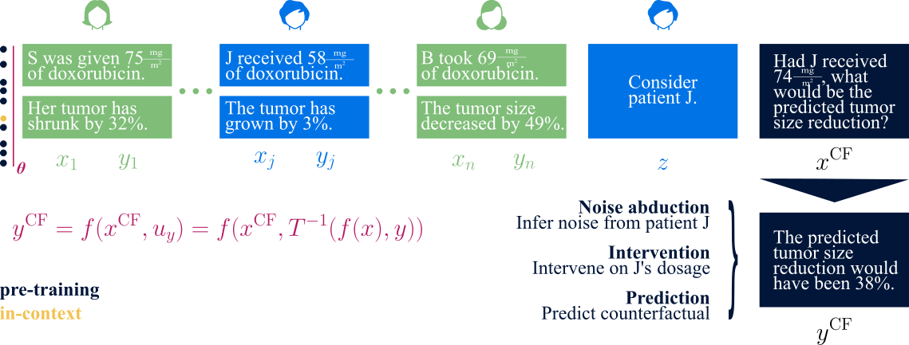

This repository[^1] contains the code for our paper:

[^1]: This repository is based on _Garg et al. 2022: What Can Transformers Learn In-Context? A Case Study of Simple Function Classes_ (http://arxiv.org/abs/2208.01066)

**Counterfactual reasoning: an analysis of in-context emergence** <br>
*Moritz Miller\*, Bernhard Schölkopf, Siyuan Guo* <br>

The paper has been accepted at NeurIPS (2025)[^2].
[^2]: You can find the poster website here: https://neurips.cc/virtual/2025/poster/116021



```bibtex
    @misc{miller2025counterfactual,
        title={Counterfactual reasoning: an analysis of in-context emergence},
        author={Moritz Miller and Bernhard Schölkopf and Siyuan Guo},
        year={2025},
        booktitle={arXiv preprint}
    }
```

## Getting started
You can start by cloning our repository and following the steps below.

1. Install the dependencies for our code using Conda. You may need to adjust the environment YAML file depending on your setup.

    ```
    conda env create -f environment.yml
    conda activate icl
    ```

2. [Optional] If you plan to train, populate `conf/wandb.yaml` with your wandb info.

That's it! You can now explore our pre-trained models or train your own. The key entry points
are as follows (starting from `src`):
- `train.py` takes as argument a configuration yaml from `conf` and trains the corresponding model. You can try `python train.py --config conf/one_head.yaml` to train an 8-layer, 1-head Transformer.
- `mm_iclr.sh` and `iclr_eval.sh` provide a range of trained configurations that can directly be trained by running the shell script.
- `write_eval.py` writes the evaluation files for a series of models. You can supply a set of arguments and evaluate on that model if it exists. You can then evalute your trained model.
- `attentions.py` assists in the analysis of the Transformer attention.
- `sde.py` is required to run the cyclic causal relationship example based on the Lotka-Volterra model. 

# Maintainers
* [Moritz Miller](https://is.mpg.de/person/mmiller)
